<p align="right">
  
</p>

<h1 style="font-size: 60px;">Guide CodeMachine</h1>

**Version 3.1.0**
9 septembre 2026

Geneviève Cyr
GIGL | Polytechnique Montréal
<br><br>
_Ce document est distribué sous licence Creative Commons Attribution 4.0 International (CC BY 4.0). Vous êtes libre de le partager, copier, distribuer et adapter, y compris à des fins commerciales, à condition d'attribuer correctement la paternité en citant les auteurs originaux.
N.B. Le masculin est utilisé pour alléger le texte._  
<br>
<br>
<br>
<br>

<div style="page-break-after: always;"></div>

# Installation

## Pour Windows

1. Aller sur GitHub : [Page GitHub de CodeMachine](https://github.com/Code-Machine-Proto/code-machine-v2)
   <br>
2. Choisir la version la plus récente (cliquer dessus)
   <p>
   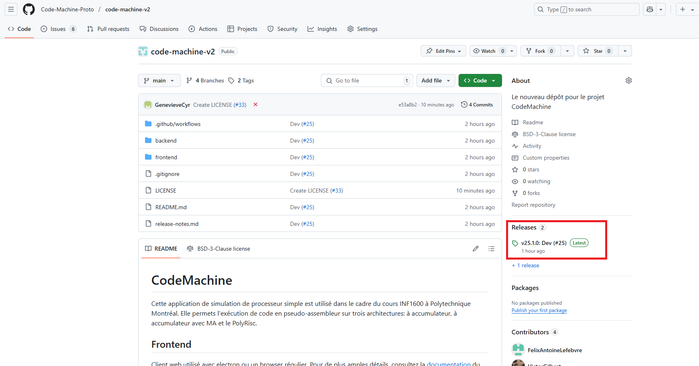
   </p>
<div style="page-break-after: always;"></div>
3. Choisir la bonne architecture (celle correspondant à votre ordinateur) et cliquer dessus pour la télécharger
   <p>
   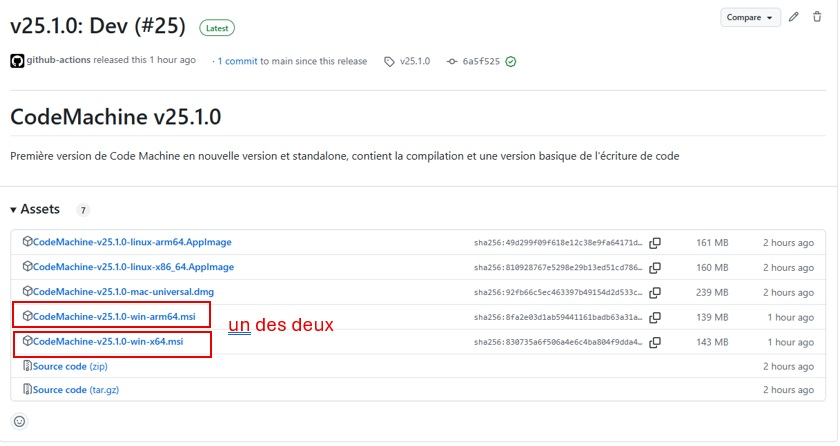
   </p>

4. Dans téléchargement, double-cliquer pour partir l’installation.
   <br>

5. Cliquer sur Information complémentaires
   <p>
   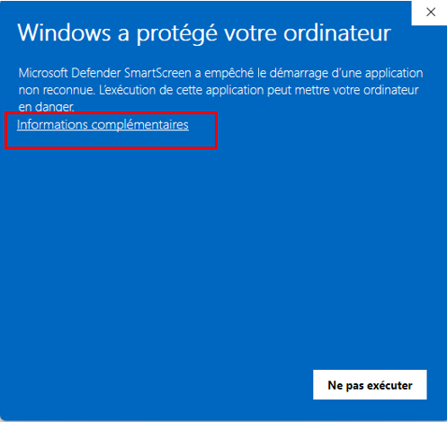
   </p>
<div style="page-break-after: always;"></div>
6. Choisir exécuter quand même
   <p>
   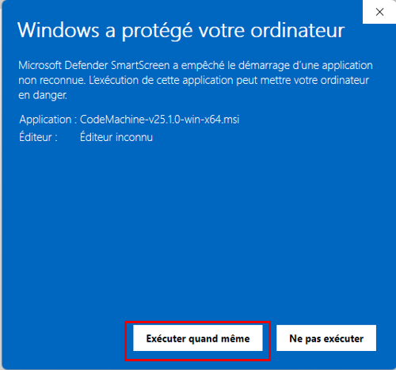
   </p>

7. Suivre les étapes d’installations
<div style="page-break-after: always;"></div>

8. Vous trouverez CodeMachine dans la barre de recherche
   <p>
   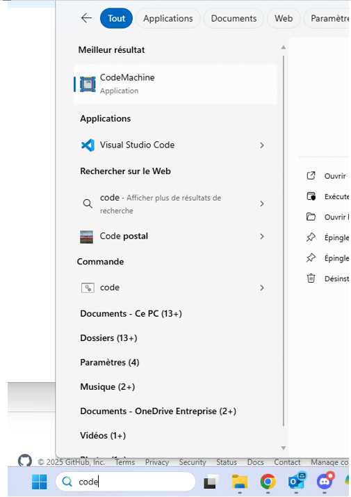
   </p>

<div style="page-break-after: always;"></div>

## Pour Linux

1. Aller sur GitHub : [Page GitHub de CodeMachine](https://github.com/Code-Machine-Proto/code-machine-v2)
   <br>
2. Choisir la version la plus récente (cliquer dessus)
   <p>
   
   </p>

3. Choisir la bonne architecture (celle correspondant à votre ordinateur) et cliquer dessus pour la télécharger
   <p>
   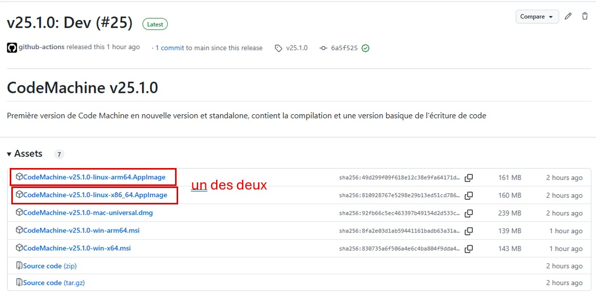
   </p>

4. Dans téléchargement, double-cliquer pour partir l’installation.
   <br>

5. Ensuite, vous avez deux options, soit aller dans téléchargement et s’assurer que le fichier est exécutable, puis **double-cliquer pour partir CodeMachine (aucune installation requise)**.
   <p>
   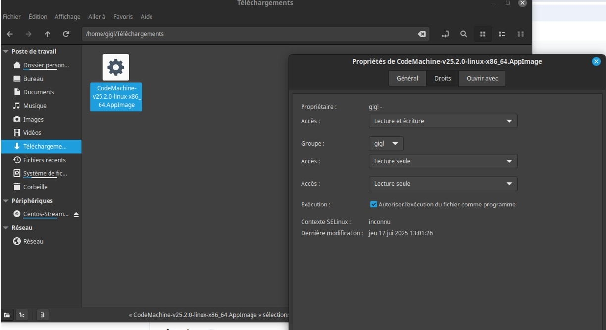
   </p>
Sinon, vous pouvez aller **par le CLI**, changer les permissions et partir l’outil comme suit :
   <p>
   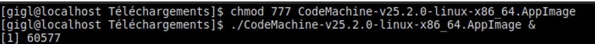
   </p>

_Notez que vous pouvez déplacer le .AppImage à l’endroit que vous préférez pour faciliter son accès. Cependant, vous devrez, dans tous les cas, permettre son exécution en changeant ses permissions._

<br>

> **ATTENTION : Sur Windows, dans certains installations, il faut parfois partir CodeMachine en mode administrateur pour qu'il compile correctement**

Si vous avez l'erreur suivante au moment de la compilation :

<p>
   
</p>
Il faut repartir CodeMachine en tant qu'administrateur en utilisant le bouton contextuel de la souris.
<p>
   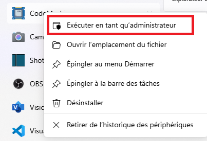
</p>

<div style="page-break-after: always;"></div>

## Pour MAC

1. Aller sur GitHub : [Page GitHub de CodeMachine](https://github.com/Code-Machine-Proto/code-machine-v2)

2. Choisir la version la plus récente (cliquer dessus)
   <p>
   
   </p>

3. Choisir l'installeur pour Mac (le même pour toutes les architectures)
   <p>
   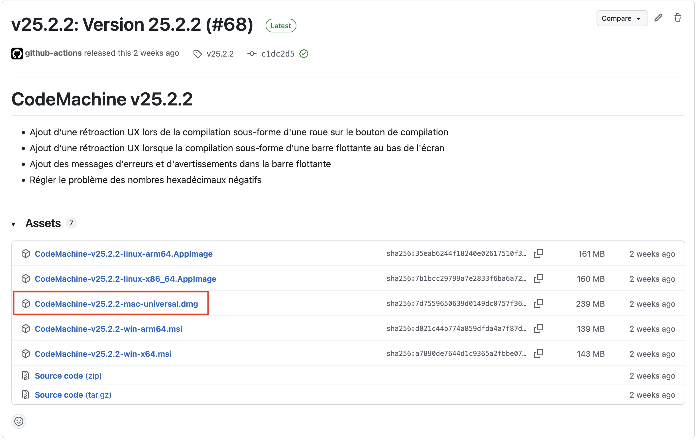
   </p>

4. Dans téléchargement, double-cliquer pour partir l'installation et compléter une installation selon le format dmg

### Méthode 2: Installation via Terminal (méthode alternative)

1. Aller sur GitHub : [Page GitHub de CodeMachine](https://github.com/Code-Machine-Proto/code-machine-v2)

2. Choisir la version la plus récente (cliquer dessus)
   <p>
   
   </p>

3. Choisir l'installeur pour Mac (le même pour toutes les architectures)
   <p>
   
   </p>

4. Dans téléchargement, double-cliquer pour partir l'installation et compléter une installation selon le format dmg

5. Enlever les drapeaux de quarantaine mis par Apple
   <p>
   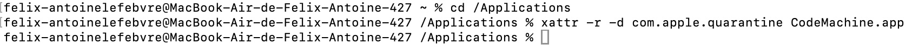
   </p>

6. Trouver l'application dans le Finder et afficher le contenu du paquet
   <p>
   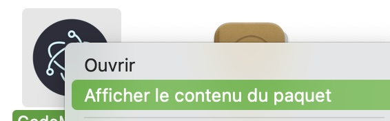
   </p>

7. Naviguer Contents > MacOS
   <p>
   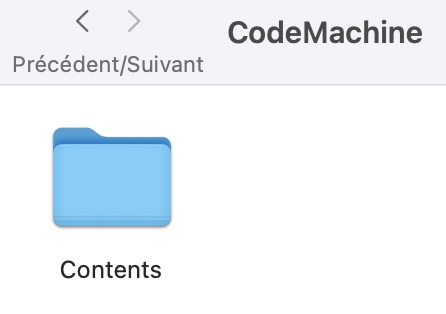
   </p>
   ---
   <p>
   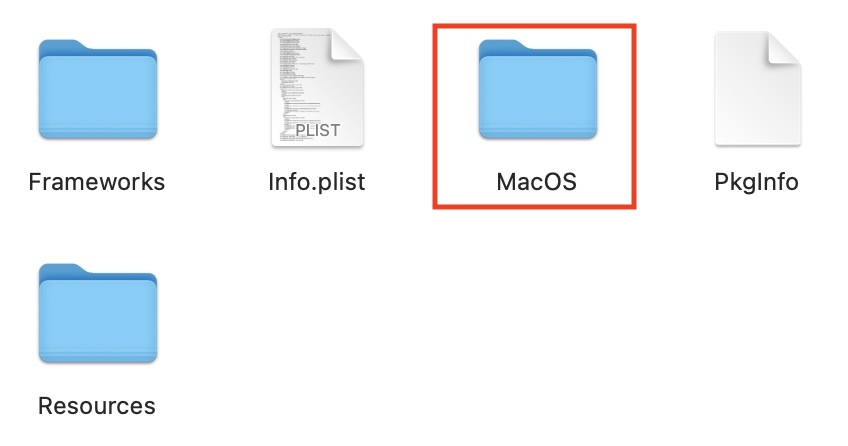
   </p>

8. Double-cliquer sur l'exécutable nommé CodeMachine pour le partir en mode administrateur, créer un alias pour mettre sur votre bureau est fortement recommandé
   <p>
   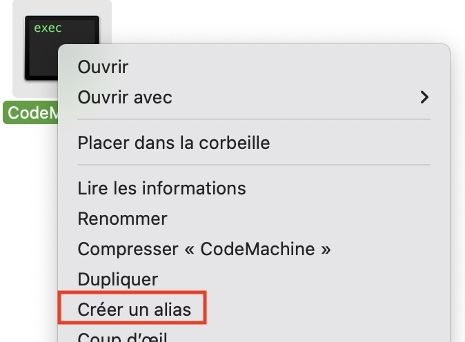
   </p>

<div style="page-break-after: always;"></div>

# Guide d’utilisation de CodeMachine

## Utilisation de l’interface graphique

### Version

Vous pourrez toujours savoir quelle version vous utilisez en regardant la version à cause de « Code Machine ». Normalement, l’outil fonctionnel devrait avoir une version supérieure ou égale à 25.2.2. Cependant, vous devriez toujours prendre la dernière version sur GitHub et vous pouvez voir les commentaires des modifications faites sur les versions directement dans Git.

### Architectures

Trois architectures sont disponibles dans CodeMachine : Accumulateur, Accumulateur-MA et PolyRisc. Vous pouvez choisir l’architecture en cliquant sur le gros bouton.

   <p>
   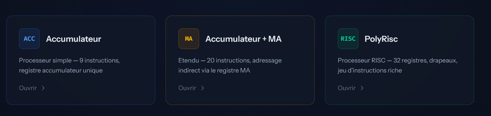
   </p>

### Raccourcis

- Pour faire un “Zoom In” : ctrl + (souvent ctrl-shift=)
- Pour faire un “Zoom out” : ctrl –
- Vous pouvez être en mode « plein écran » ou non à votre choix.
- Lorsque vous écrivez le code, vous pouvez utiliser « ctrl-Z » et « ctrl-y » pour annuler ou répéter une frappe.
- Pour revenir au menu principal (donc quitter une architecture pour aller dans un autre), appuyer sur la flèche blanche ou directement sur Code Machine.
   <p>
   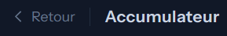
   </p>

<div style="page-break-after: always;"></div>

### Masquer/Afficher les panneaux

Pour maximiser l’espace disponible selon vos besoins, plusieurs panneaux de l’interface peuvent être réduits (masqués) ou agrandis (rétablis) à l’aide d’une petite flèche cliquable située à côté de leur titre.

- **L’éditeur de code** (panneau de gauche) peut être réduit en cliquant sur la flèche à côté du titre « Éditeur ». Une fois réduit, il se replie sur le bord gauche sous la forme d’une bande verticale, et le circuit prend toute la place ainsi libérée.
   <p>
   
   </p>

- **Le panneau de droite** (Registres et Mémoire) peut être réduit de la même façon, en cliquant sur la flèche à côté du titre « Registres ». Il se replie alors sur le bord droit.

- À l’intérieur du panneau de droite, les sections **Registres** et **Mémoire** peuvent aussi être réduites indépendamment l’une de l’autre, toujours avec la même flèche à côté de leur titre respectif. Réduire l’une des deux sections donne automatiquement plus d’espace à l’autre.
   <p>
   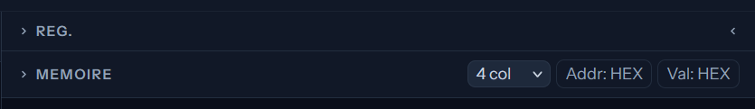
   </p>

Pour rétablir un panneau réduit, il suffit de cliquer à nouveau sur la flèche (ou sur la bande verticale portant son nom, dans le cas de l’éditeur ou du panneau de droite au complet).

<div style="page-break-after: always;"></div>

### Menu du haut (Importer, Sauvegarder, Compiler)

   <p>
   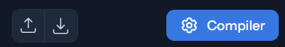
   </p>

En haut de l’éditeur de code, un menu vous donne accès à trois actions :

- **Icône de téléversement (↑)** : importe le code d’un fichier depuis votre ordinateur dans l’éditeur.
- **Icône de téléchargement (↓)** : enregistre le code actuel de l’éditeur dans un fichier sur votre ordinateur.
- ** ⚙️ Compiler** : Compile le programme

> **ATTENTION : Importer un fichier ou effacer le code sont des actions irréversibles.** Une fenêtre d’avertissement vous demandera de confirmer avant de procéder :
>
> <p>
> 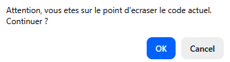
> </p>
>
> Cliquer sur « Ok » remplacera définitivement le contenu actuel de l’éditeur (par le fichier importé, ou par un éditeur vide). Assurez-vous d’avoir sauvegardé votre code au préalable (avec l’icône de téléchargement) si vous souhaitez le conserver.

### Compilation

- Le dernier code entré dans chaque architecture devrait être mémorisé quand vous quittez l’architecture. Cependant, dès que vous quittez une architecture, en retournant dans n’importe quelle architecture, il faut recompiler. Pour savoir si le code est compilé, regardez le / en haut.
   <p>
   
   </p>
- Cette icône apparaîtra lorsque le code est en train de se faire compiler. <p>
  
   </p>
- Une modification à un code compilé affichera cette icône pour indiquer qu'une modification a eu lieu et qu'il faut recompiler.
    <p>
   
   </p>
- Si des erreurs de syntaxes sont présentes, cet icône apparaîtra et indiquera le nombre de celles-ci. <p>
  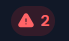
   </p>
- Un code compilé avec succès et prêt à être exécuté affichera l'icône suivante : <p>
  
   </p>

### Affichage du nombre de cycles

> **ATTENTION : CodeMachine est limité à 4096 cycles au total. Tout code qui donnera plus de 4096 cycles, seulement les 4096 premiers cycles seront exécutés.**

- Les cycles sont comptés à partir de 1, donc le nombre total de cycle (/nb) sera toujours égale au nombre de cycle. Pour toutes les architectures, chaque instruction prend 3 cycles (incluant l’instruction « nop »).

- Pour naviguer dans le code vous avez plusieurs options.
  1. Utiliser le « play » (triangle bleu simple) et le code sera exécuté automatiquement, étapes par étapes.

  2. Utiliser les boutons « next step » ou « previous step » (triangle bleu avec barre verticale), pour exécuter le code une étape à la fois.

  3. Utiliser les boutons « goto end » ou « goto start » (double triangle bleu), pour aller directement à la fin ou au début du code.

  4. Décider exactement à quel cycle aller en entrant le nombre de cycle à la place du chiffre qui apparaît avant le « / »
  <p>
  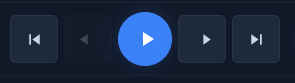
  </p>

- Lorsque vous utilisez le mode « régulier », une étape correspond à un cycle. Donc chaque instruction passera par les étapes : « fetch », « decode », « execute » (3 cycles).

- Lorsque vous utilisez le mode « exécution », chaque étape correspond à une instruction. Ainsi, chaque étape passera d’un cycle « execute » d’une instruction à l’autre (par bond de 3 cycles).
   <p>
   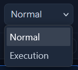
   </p>

- Le cycle auquel vous êtes rendu est toujours affiché dans le nombre avant le « / ». Attention de penser additionner un à ce nombre pour savoir exactement à quel cycle vous êtes rendus (puisque les cycles sont comptés à partir de 0). Vous pouvez aussi, en tout temps, voir à quel stade d’exécution de l’instruction vous êtes dans le petit rectangle blanc : « fetch », « decode », « execute ».
   <p>
   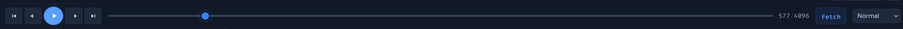
   </p>

### Surbrillance du code et erreur de syntaxes

- Normalement, les instructions sont en _rouge_, les « déclarations » d’étiquettes en _vert_, les registres en _bleu_ et les valeurs sont en _mauve_ dans votre code.
   <p>
   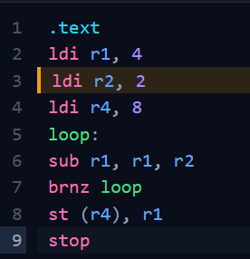
   </p>

- Les erreurs de syntaxes devraient être soulignées en _rouge_ et les avertissements ("warnings") en _jaune_ et tant que vous avez des soulignements rouges dans le code, vous ne pourrez pas accéder au bouton « Compiler » qui sera _rouge_. Normalement, lorsque vous avez des soulignements dans le code, une fenêtre devrait apparaître et vous indiquer le type d'erreur précédé du numéro de la ligne qui contient une erreur.
  > **ATTENTION : Lorsqu'il y a une erreur dans une ligne de code, il se pourrait que la surbrillance des erreurs des lignes suivantes ne soient pas exactes. Il est très important de régler les premières erreurs dans le code pour pouvoir continuer la correction des lignes suivantes**
- Si vous compilez et qu’une erreur se produit (qui n’a pas été détectée par le « parser »), un message vous l’indiquera, mais vous devrez trouver sans aide le problème de votre côté.

  > **Ne vous gênez pas pour ouvrir des "issues" sur GitHub si ce genre de situation se produise pour qu'on puisse améliorer l'outil.**

- Les règles d’écriture du code sont données dans la section « Grammaire du code ».

- Si votre code est trop long pour s’afficher au complet à l’écran, vous devez utiliser la roulette de la souris pour faire défiler le code. Il n’y a pas de barre de défilement.
- Vous pouvez voir l'instruction en cours d'exécution par sa surbrillance.

### Organisation mémoire

- **Les numéros de ligne** dans votre code assembleur **ne correspondent PAS** aux adresses mémoires réelles

- **Les directives** (`.text`, `.data`) ne sont **pas écrites en mémoire** - elles indiquent seulement au compilateur comment organiser les sections

- **Ordre en mémoire:**
  1. Section `.text` (programme) → placée en premier en mémoire
  2. Section `.data` (données) → placée après le code
- **Les étiquettes** (comme `loop:`) ne sont **pas écrites en mémoire** - elles sont remplacées par l'adresse de l'instruction suivante lors de l'assemblage

**Exemple:**

```
.text              # Cette directive n'occupe pas de mémoire
ld n               # Occupe de la mémoire (adresse 0)
loop:              # Remplacée par l'adresse réelle (adresse 1)
sub one            # Occupe de la mémoire (adresse 1)
brnz loop          # Occupe de la mémoire (adresse 2), "loop" → adresse 1
st n               # Occupe de la mémoire (adresse 3)
stop               # Occupe de la mémoire (adresse 4)

.data              # Cette directive n'occupe pas de mémoire
n: 5               # Occupe de la mémoire (adresse 5)
one: 1             # Occupe de la mémoire (adresse 6)
```

**Dans cet exemple:**

- Les instructions (`.text`) occupent les adresses 0 à 4
- Les données (`.data`) occupent les adresses 5 et 6
- L'étiquette `loop:` est remplacée par l'adresse 1
- Les directives `.text` et `.data` n'occupent aucun espace mémoire

## Affichage de la mémoire

- La mémoire ainsi que le contenu des registres sont affichés à la droite du programme. Les valeurs ne sont valides qu'après avoir compilé le programme. <p>
  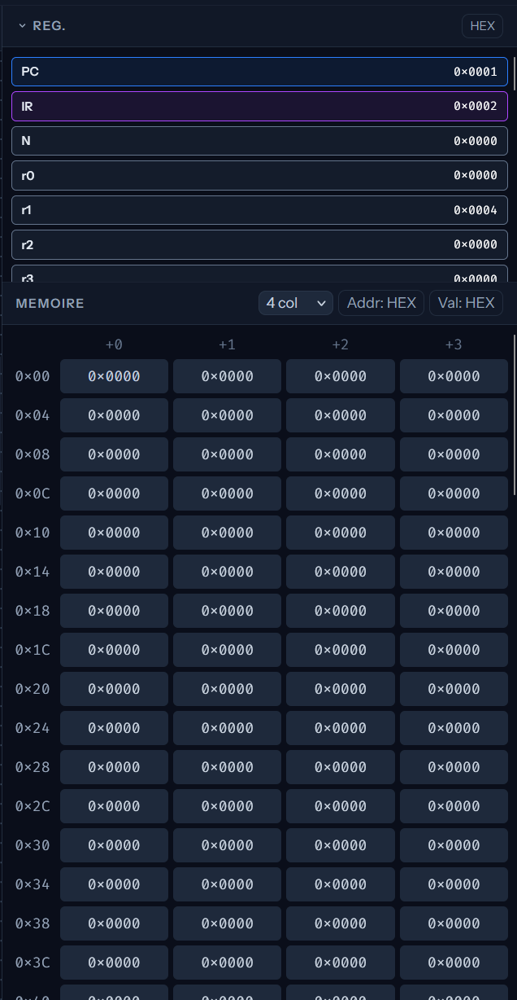
   </p>

- Il est possible de choisir si les adresses et les données sont en décimal ou en hexadécimal avec les deux boutons dans le haut de la mémoire.

- Vous pouvez aussi choisir le « mode » d’affichage (1, 2 ou 4) qui vous mettra 1, 2 ou 4 adresses par ligne (selon votre préférence).

- Vous remarquerez qu’il y a des adresses pour chaque ligne et chaque colonne. En fait l’adresse mémoire d’une valeur (exemple : 776) correspond à la somme de l’adresse de la ligne et de la colonne (exemple : 0x4+0x1 = 0x5 pour la donnée 776). Attention, dans CodeMachine les données sont TOUJOURS de 16 bits (2 octets) et ne sont pas accessibles par octet. Chaque adresse mémoire pointe sur une case mémoire d’une grandeur de 16 bits. Ce sont ces cases que vous voyez dans chaque rectangle.

- Pour se promener dans la mémoire et faire défiler les adresses, il n’y a pas de barre de défilement, vous devez utiliser la roulette de la souris pour faire défiler la mémoire.

<div style="page-break-after: always;"></div>

## Grammaire du code

- Le code devra toujours suivre les règles suivantes :

- La directive « .data » est facultative et une directive « .data » vide est acceptée.

- Les étiquettes (« label ») doivent être constituées de seulement des lettres minuscules, des lettres majuscules, des chiffres et des tirets du bas(\_) (attention, les étiquettes sont sensibles à la case)

- Les instructions doivent être en minuscules seulement (tout est sensible à la case)

- La déclaration des étiquettes doit toujours mettre le « : » sans espace entre l’étiquette et le « : » (Ex : loop: et non loop : )

- Les nombres entrés dans le code, comme valeur, doivent toujours être des nombres entiers (négatif ou non)

- Chaque instruction doit être séparée par un « new line » (retour de charriot)

- À part pour la déclaration d’étiquettes, il n’y a aucune dépendance aux espaces

- Les lignes vides à la fin du code ne sont pas problématiques.

- Les commentaires peuvent utiliser le « # » ou les « // » et ce n’importe où dans la ligne (sans code ou après le code)

<div style="page-break-after: always;"></div>

## Comment entrer des « issues » sur CodeMachine.

Si vous avez des problèmes avec CodeMachine, vous pouvez les souligner aux développeurs. Cela se fera directement sur GitHub.

1. Vous devez d’abord aller dans « Issues » :
   <p>
   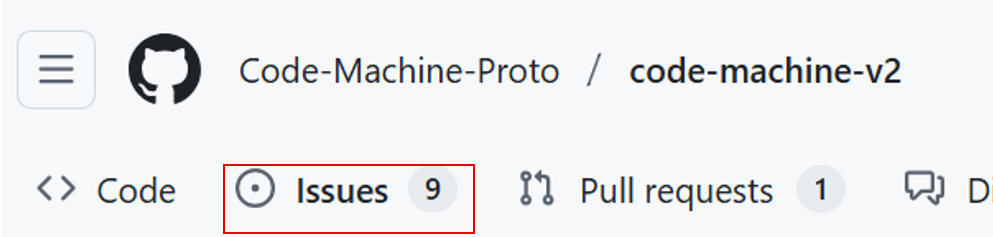
   </p>

2. Regarder si votre problème n’a pas été déjà entré en lisant les « open » issues
   <p>
   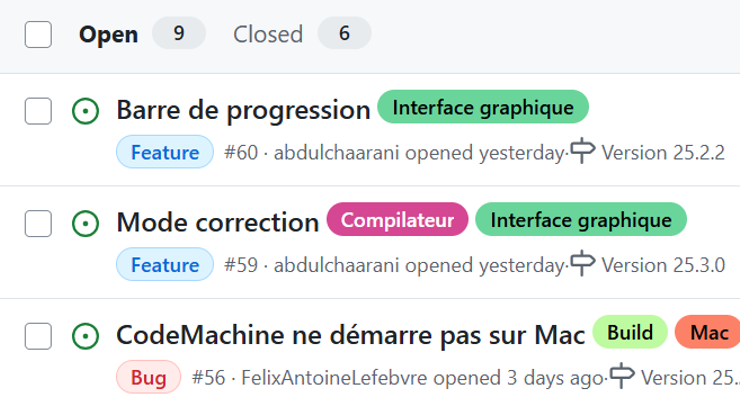
   </p>

3. Aller dans « New Issue »
   <p>
   
   </p>

4. Choisir « bug » si c’est un problème avec ce qui est déjà implanté ou « nouvelle fonctionnalité » si vous avez une demande de modifications de CodeMachine (dans sa fonctionnalité).
   <p>
   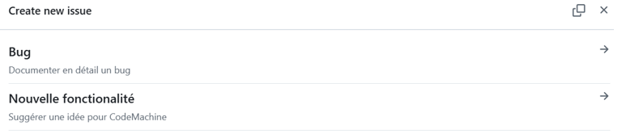
   </p>

5. Dans chacun des cas, il y a un « template » de base qui vous guide dans l’information à entrer dans votre « issue » pour faciliter la compréhension du développeur. SVP, suivez ces instructions pour faciliter leur travail.

Notez que vous avez accès au code (c’est « open source »), alors vous pouvez faire un clone et jouer dans le code à votre aise si vous le désirez. Vous avez aussi une manière de déployer votre version automatiquement (pour vous-même), mais nous ne supporterons pas le code, juste l’interface. De plus, les accès en écriture sont proscrits, seulement les développeurs pourront changer le code en cours.

<div style="page-break-after: always;"></div>

# Architecture Processeur-accumulateur

## Circuit logique

### CodeMachine

   <p>
   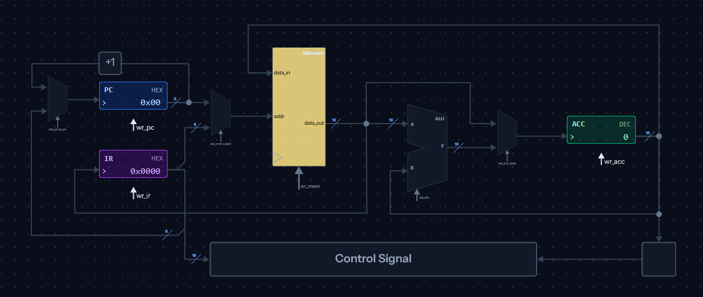
   </p>

### Détaillé

   <p>
   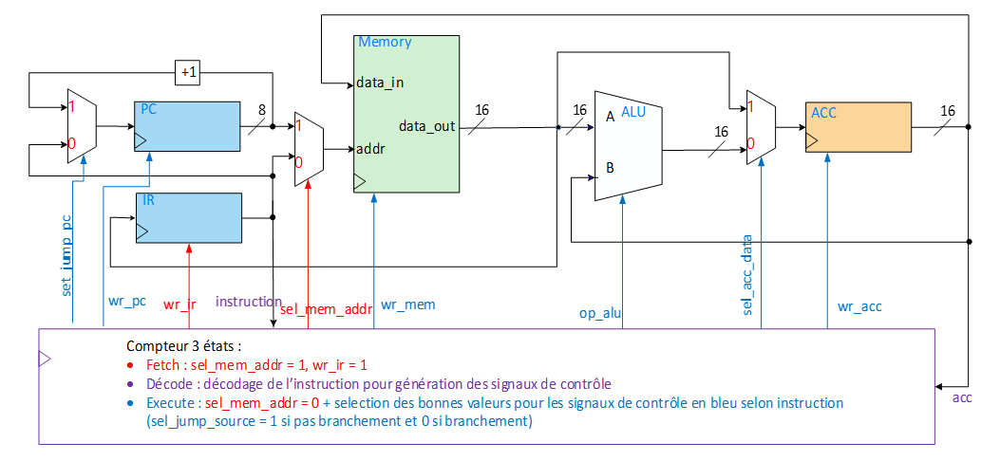
   </p>

<div style="page-break-after: always;"></div>

## Instructions

| Instruction | Encodage | Description                         |
| ----------- | -------- | ----------------------------------- |
| add ADR     | 0x00XX   | ACC <- ACC + Mémoire[ADR]           |
| sub ADR     | 0x01XX   | ACC <- ACC - Mémoire[ADR]           |
| mul ADR     | 0x02XX   | ACC <- ACC × Mémoire[ADR]           |
| st ADR      | 0x03XX   | Mémoire[ADR] <- ACC                 |
| ld ADR      | 0x04XX   | ACC <- Mémoire[ADR]                 |
| stop        | 0x05XX   | Arrêt du programme                  |
| br ADR      | 0x07XX   | PC <- ADR                           |
| brz ADR     | 0x08XX   | ACC = 0 ? PC <- ADR : PC <- PC + 1  |
| brnz ADR    | 0x09XX   | ACC != 0 ? PC <- ADR : PC <- PC + 1 |

### Opérations ALU

| op_alu | opération |
| ------ | --------- |
| 0      | B + A     |
| 1      | B – A     |
| 2      | B x A     |

<div style="page-break-after: always;"></div>

# Architecture Processeur-accumulateur-MA

## Circuit logique

### CodeMachine

   <p>
   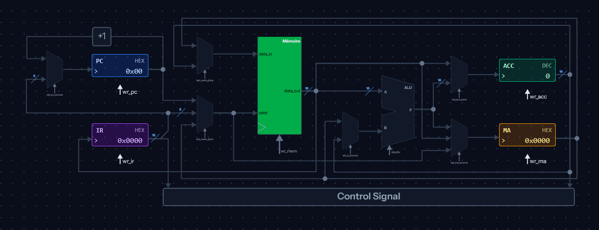
   </p>
   
**Attention:** Une nouvelle instruction (lea) a été ajoutée dans le jeu d'instructions et n'est pas encore représentée dans le schéma de CodeMachine.  Voici ce qu'il manque et sera ajouté éventuellement dans l'interface graphique.
   <p>
   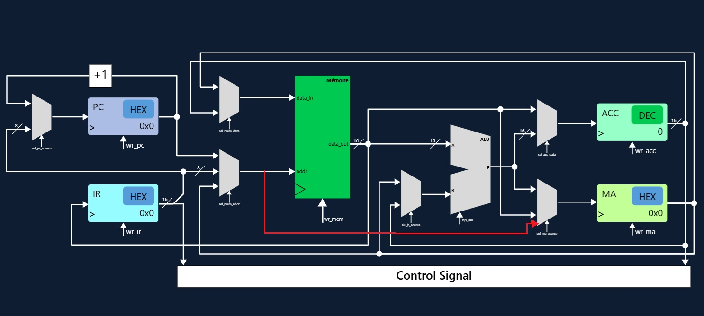
   </p>

Pour plus de détails, consultez [l'issue #123](https://github.com/Code-Machine-Proto/code-machine-v2/issues/123) sur GitHub.

<div style="page-break-after: always;"></div>

### Détaillé

   <p>
   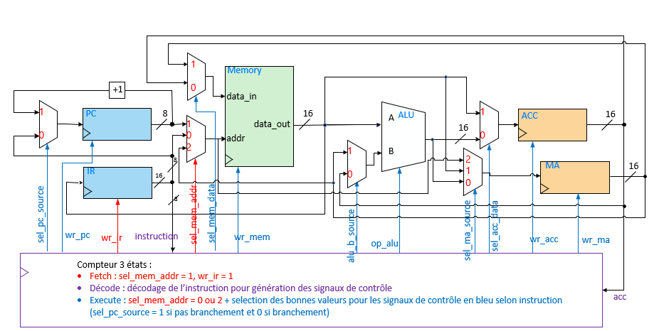
   </p>

<div style="page-break-after: always;"></div>

## Instructions

| Instruction | Encodage | Description                         |
| ----------- | -------- | ----------------------------------- |
| add ADR     | 0x00XX   | ACC <- ACC + Mémoire[ADR]           |
| sub ADR     | 0x01XX   | ACC <- ACC - Mémoire[ADR]           |
| mul ADR     | 0x02XX   | ACC <- ACC × Mémoire[ADR]           |
| adda ADR    | 0x03XX   | MA <- MA + Mémoire[ADR]             |
| suba ADR    | 0x04XX   | MA <- MA - Mémoire[ADR]             |
| addx        | 0x05XX   | ACC <- ACC + Mémoire[MA]            |
| subx        | 0x06XX   | ACC <- ACC - Mémoire[MA]            |
| ld ADR      | 0x07XX   | ACC <- Mémoire[ADR]                 |
| st ADR      | 0x08XX   | Mémoire[ADR] <- ACC                 |
| lda ADR     | 0x09XX   | MA <- Mémoire[ADR]                  |
| sta ADR     | 0x0AXX   | Mémoire[ADR] <- MA                  |
| ldi         | 0x0BXX   | ACC <- Mémoire[MA]                  |
| sti         | 0x0CXX   | Mémoire[MA] <- ACC                  |
| br ADR      | 0x0DXX   | PC <- ADR                           |
| brz ADR     | 0x0EXX   | ACC = 0 ? PC <- ADR : PC <- PC + 1  |
| brnz ADR    | 0x0FXX   | ACC != 0 ? PC <- ADR : PC <- PC + 1 |
| shl         | 0x10XX   | ACC <- ACC << 1                     |
| shr         | 0x11XX   | ACC <- ACC >> 1                     |
| lea ADR     | 0x12XX   | MA <- ADR                           |
| stop        | 0x13XX   | Arrêt du programme                  |

### Opérations ALU

| op_alu | opération |
| ------ | --------- |
| 0      | B + A     |
| 1      | B – A     |
| 2      | B x A     |
| 3      | B << 1    |
| 4      | B >> 1    |

<div style="page-break-after: always;"></div>

# PolyRisc

## Circuit logique

### CodeMachine

   <p>
   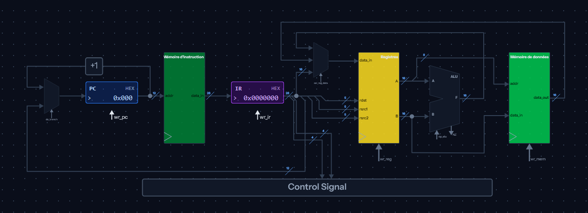
   </p>

### Détaillé

   <p>
   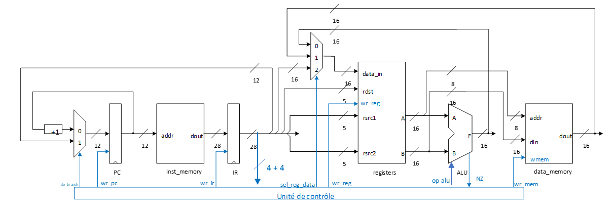
   </p>

<div style="page-break-after: always;"></div>

## Instructions

   <p>
   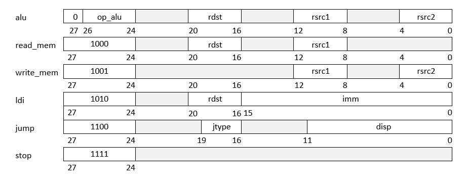
   </p>

### Format des types d'instruction

### Types et syntaxe des instructions de l’UAL et de branchements

| Champ | Valeur | Type d’opération          | Syntaxe assembleur     |
| ----- | ------ | ------------------------- | ---------------------- |
| op    | 0      | Addition arithmétique     | add rdst, rsrc1, rsrc2 |
| op    | 1      | Soustraction arithmétique | sub rdst, rsrc1, rsrc2 |
| op    | 2      | Décalage binaire à droite | shr rdst, rsrc1        |
| op    | 3      | Décalage binaire à gauche | shl rdst, rsrc1        |
| op    | 4      | NON logique               | not rdst, rsrc1        |
| op    | 5      | ET logique                | and rdst, rsrc1, rsrc2 |
| op    | 6      | OU logique                | or rdst, rsrc1, rsrc2  |
| op    | 7      | Affectation               | mv rdst, rsrc1         |
| jtype | 0      | Jump non conditionnel     | br label               |
| jtype | 1      | Jump si nul (Z=1)         | brz label              |
| jtype | 2      | Jump si non nul (Z=0)     | brnz label             |
| jtype | 3      | Jump si négatif (N=1)     | brlz label             |
| jtype | 4      | Jump si non négatif (N=0) | brgez label            |

<div style="page-break-after: always;"></div>

### Types et syntaxe des instructions de lecture, écriture, chargement et d'arrêt

| Type d’opération         | Syntaxe assembleur |
| ------------------------ | ------------------ |
| Lecture de la mémoire    | ld rdst, (rsrc1)   |
| Écriture dans la mémoire | st (rsrc1), rsrc2  |
| Chargement d’un immédiat | ldi rdst, imm      |
| Arrêter l’exécution      | Stop               |
